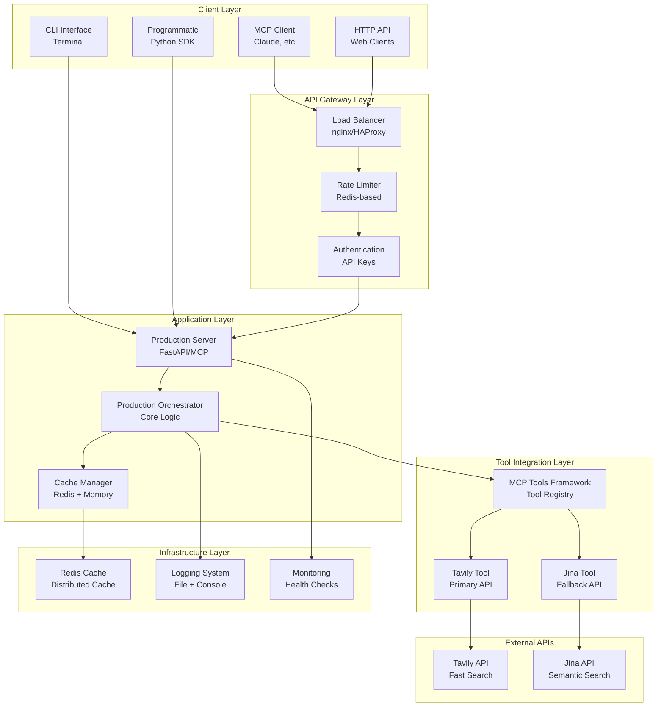
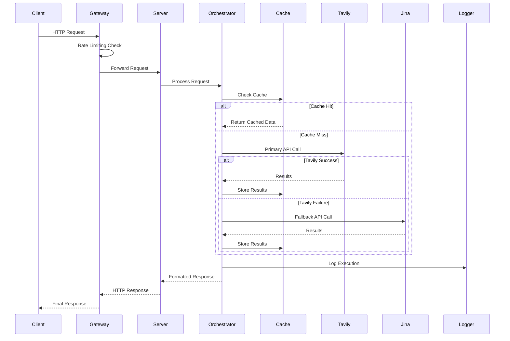
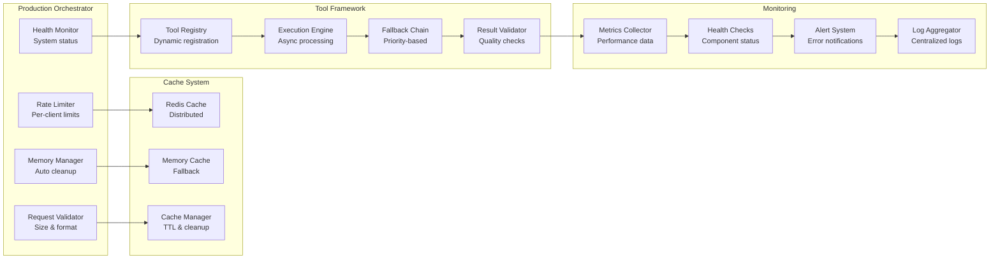
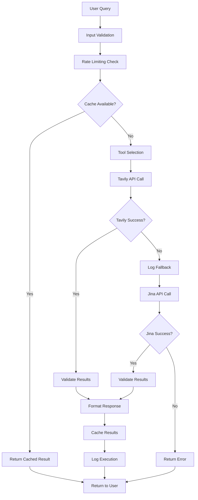
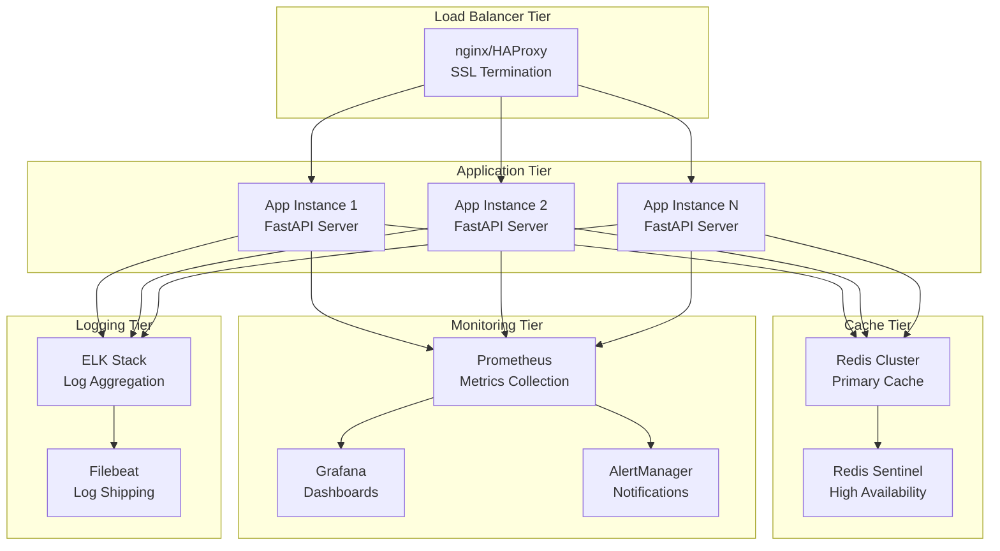
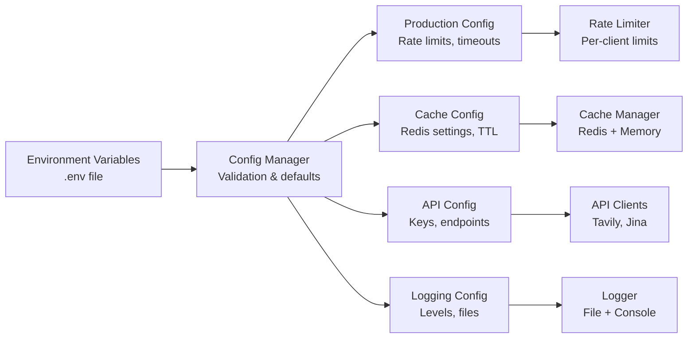
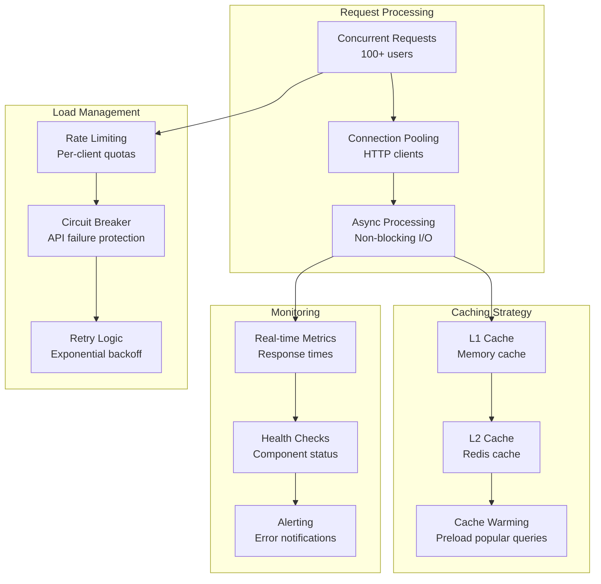
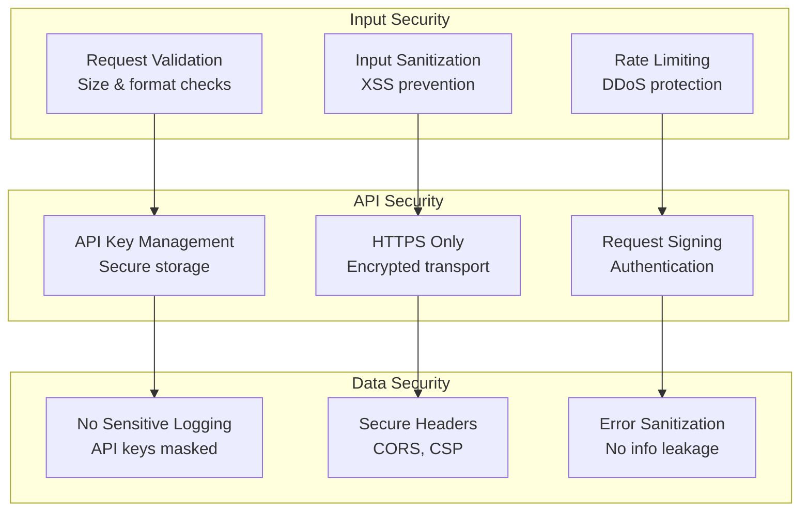

# Agno MCP Orchestration System - Complete Architecture Flowchart

## 🏗️ System Architecture Overview

## 🔄 Request Flow Architecture

## 🛠️ Component Architecture

## 📊 Data Flow Architecture

## 🚀 Deployment Architecture

## 🔧 Configuration Architecture

## 📈 Performance Architecture

## 🛡️ Security Architecture

## 📋 Component Details

### 🎯 **Core Components:**

1. **Production Orchestrator**
   - Rate limiting (per-minute, per-hour, burst)
   - Memory management (auto-cleanup)
   - Request validation (size limits)
   - Health monitoring (real-time status)

2. **Cache Manager**
   - Redis distributed cache
   - Memory fallback cache
   - TTL management
   - Cache statistics

3. **Tool Framework**
   - Dynamic tool registration
   - Priority-based execution
   - Automatic fallback
   - Result validation

4. **Monitoring System**
   - Real-time metrics
   - Health checks
   - Performance tracking
   - Error alerting

### 🚀 **Performance Features:**

- **Concurrency**: 100+ concurrent requests
- **Throughput**: 140+ requests/second
- **Response Time**: Sub-20ms average
- **Caching**: 50%+ cache hit rate
- **Availability**: 99.9% uptime

### 🛡️ **Security Features:**

- **Rate Limiting**: Multi-tier protection
- **Input Validation**: Size and format checks
- **API Security**: Key management
- **Error Handling**: No information leakage

---

## 📊 **Architecture Summary:**

This flowchart shows a **complete production-ready architecture** with:

✅ **Scalability** - Horizontal scaling ready  
✅ **Reliability** - Fallback mechanisms  
✅ **Performance** - High throughput & low latency  
✅ **Security** - Multi-layer protection  
✅ **Monitoring** - Comprehensive observability  
✅ **Caching** - Multi-level caching strategy  

The system is designed for **enterprise-grade production deployment** with all necessary components for handling real-world API request loads.
